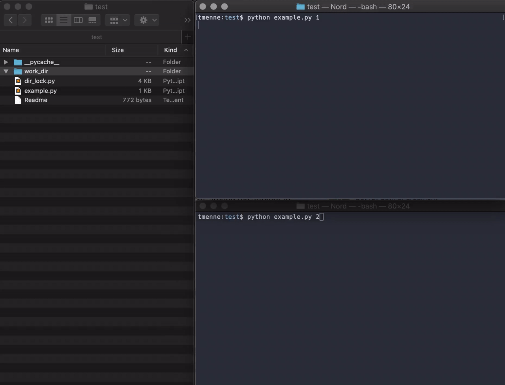

# DirLock

A very simple directory lock using a temporary lock file.
While the lock is present, another process cannot write into the directory.
At least if it is using the same lock mechanism, of course any process can write into the directory if it likes...

Apparently this seems to be much cooler: https://pypi.org/project/filelock/

## FAQ

- Is this tested?
    + yes
- Does it always work as advertised?
    + Probably not
- Install with `pip install [--user] .` when in the directory with the `setup.py` in it

## Usage

The `DirLock` acts as a context manager and cleans up after itself:

```python
from dir_lock import DirLock

# The directory we want to lock is the parent of the given lock filename
lock_file = "./work_dir/_lock"
print("I want to lock '{}'".format(os.path.dirname(lock_file)))

with DirLock(lock_file, create_dir=True) as dlock:
    print("Created lockfile '{}', sleeping for 5s".format(dlock.lock_file))
    time.sleep(5.)

assert not os.path.isfile(lock_file)
print("Done, left lock. Lockfile is gone")
```

## Example

Also try the example script in two different processes:


